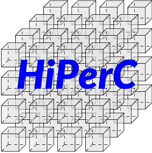

*****************************************************************
High Performance Computing Strategies for Boundary Value Problems
*****************************************************************

|GitHub|_ |readthedocs|_ |Gitter|_ |Codacy|_

Ever wonder if a GPU or Xeon Phi accelerator card would make your code faster?
Fast enough to justify the expense to your manager, adviser, or funding agency?
This project can help answer your questions!

The example codes in this repository implement the same basic algorithm using
whichever of the mainstream accelerator programming methods apply. Running the
code on different parallel hardware configurations — CPU threading, GPU
offloading, and CPU coprocessing — provides a benchmark of these tools
using common computational materials science workloads. Comparing performance
against the serial baseline will help you make informed decisions about which
development pathways are appropriate for your scientific computing projects.
Note that the examples do not depend on a particular simulation framework:
dependencies are kept minimal, and the C functions are kept as simple as
possible to enhance readability for study and reusability in other codes.
The goal here is to learn how to use accelerators for materials science
simulations, not to enhance or promote any particular software package.

=====================
Accelerator Languages
=====================

There are six mainstream approaches to shared-memory parallel programming,
with varying coding complexity and hardware dependencies:

POSIX_ threads
   MIMD_-capable threading for multi-core CPU
   architectures. Challenging to properly implement, but with ample opportunity
   to tune performance. Provided by all compilers and compatible with any
   hardware configuration.

OpenMP_
   Loop-level parallelism for multi-core CPU architectures.
   Simple to implement for SIMD_ programs, but with little opportunity
   for performance tuning. Implementation simply requires prefixing target
   loops with ``#pragma`` directives. Provided by all compilers and
   compatible with any hardware configuration.

`Threading Building Blocks`_
   Loop-level parallelism for multi-core
   CPU architectures using C++. Similar to OpenMP_, but requires a
   wrapper around parallel regions that is more complicated than a one-line
   ``#pragma``. This provides more direct opportunities for performance
   tuning. Available as an open-source library.

OpenACC_
   Loop-level massive parallelism for GPU architectures.
   Like OpenMP_, implementation requires prefixing target code with
   ``#pragma`` directives, with little opportunity for performance tuning.
   Provided in compilers from Cray_, PGI_, and GNU_;
   depends on a compatible graphics card, drivers, and CUDA_ or
   OpenCL_ library installation.

CUDA_
   General-purpose massive parallelism for GPU architectures.
   Like POSIX threading but for GPUs, provides low-level capabilities and ample
   opportunity for performance tuning. Requires a purpose-built compiler (nvcc,
   gpucc), libraries, and a compatible graphics card or accelerator.

`Xeon Phi`_
   Low-level and loop-level massive parallelism for ccNUMA_ many-integrated-core
   CPU architectures supporting AVX-512 vectorized instructions. First-gen
   Knights Corner (KNC_) cards were coprocessors, but second-gen Knights
   Landing (KNL_) devices can run code natively. Programmed like threaded CPU
   code, but with more opportunities for tuning and much greater performance.
   Only available through the Intel compiler, and requires Xeon Phi hardware.

Generically speaking, OpenMP_ and OpenACC_ provide low barriers
for entry into acceleration; CUDA_ and `Xeon Phi`_ require high
investments for hardware and compilers, but offer the greatest capabilities for
performance and optimization of a specific application. CUDA hardware can be
emulated on the CPU using the MCUDA_ framework. Proof-of-concept
trials on GPU and KNL hardware can be run on Amazon's EC2_,
Rescale's ScaleX_, and equivalent HPC cloud computing platforms.
Most of the current generation of research supercomputers contain GPU or KNL
accelerator hardware, including Argonne National Labs'
Bebop_, NERSC Cori_, TACC Stampede2_, and XSEDE_.

===============
Basic Algorithm
===============

Diffusion and phase-field problems depend extensively on the divergence of
gradients, *e.g.*

.. math::
    \frac{\partial c}{\partial t} = \nabla\cdot D\nabla c

When *D* is constant, this simplifies to

.. math::
    \frac{\partial c}{\partial t} = D\nabla^2 c

This equation can be discretized, *e.g.* in 1D:

.. math::
    \frac{\Delta c}{\Delta t} \approx D\left[\frac{c_{+} - 2c_{\circ} + c_{-}}{\left(\Delta x\right)^2}\right]

This discretization is a special case of convolution_, wherein a
constant kernel of weighting coefficients is applied to an input dataset to
produce a transformed output.

+----+----+----+
| 1D Laplacian |
+====+====+====+
| 1  | -2 |  1 |
+----+----+----+

+-----+-----+-----+
|   2D Laplacian  |
+-----+-----+-----+
| 5-point stencil |
+=====+=====+=====+
|   0 |   1 |   0 |
+-----+-----+-----+
|  1  |  -4 |   1 |
+-----+-----+-----+
|  0  |   1 |   0 |
+-----+-----+-----+

+-----+------+-----+
|   2D Laplacian   |
+-----+------+-----+
| 9-point stencil* |
+=====+======+=====+
|   1 |   4  |   1 |
+-----+------+-----+
|   4 |  -20 |   4 |
+-----+------+-----+
|   1 |   4  |   1 |
+-----+------+-----+

    \* This canonical 9-point (3×3) stencil uses first- and
    second-nearest neighbors. There is a 9-point (4×4) form that uses first-
    and third-nearest neighbors, which is also implemented in the source code;
    it is less efficient than the canonical form.

In addition, computing values for the next timestep given values from the
previous timestep and the Laplacian values is a vector-add operation.
Accelerators and coprocessors are well-suited to this type of computation.
Therefore, to demonstrate the use of this hardware in materials science
applications, these examples flow according to the following pseudocode:

::

    Start
        Allocate arrays using CPU
        Apply initial conditions to grid marked "old" using CPU
        While elapsed time is less than final time
        Do
            Apply boundary conditions using CPU
            Compute Laplacian using "old" values using accelerator
            Solve for "new" values using "old" and Laplacian values using accelerator
            Increment elapsed time by one timestep
            If elapsed time is an even increment of a specified interval
            Then
                Write an image file to disk
            Endif
        Done
        Write final values to disk in comma-separated value format
        Free arrays
    Finish

-------------------------
Source Code Documentation
-------------------------

You are encouraged to browse the source for this project to see how it works.
This project is documented using Doxygen_, which can help guide you
through the source code layout and intent. This guide is included as
`hiperc_guide.pdf`_. To build the
documentation yourself, with Doxygen_, LaTeX_, and
Make_ installed, ``cd`` into ``doc`` and run ``make``. Then
browse the source code to your heart's content.

==================================
Running the Demonstration Programs
==================================

This repository has a flat structure. Code common to each problem type are
lumped together, *e.g.* in ``common-diffusion``. The remaining implementation
folders have three-part names: ``architecture-threading-model``. To compile
code for your setup of interest, ``cd`` into its directory and run ``make``
(note that this will not work in the ``common`` folders). If the executable
builds, *i.e.* ``make`` returns without errors, you can ``make run``
to execute the program and gather timing data. If you wish to attempt building
or running all the example codes, execute ``make`` or ``make run`` from
this top-level directory: it will recursively call the corresponding ``make``
command in every sub-directory.

--------------
What to Expect
--------------

As the solver marches along, an indicator will display the start time, progress,
and runtime in your terminal, *e.g.*

    Fri Aug 18 21:05:47 2017 [• • • • • • • • • • • • • • • • • • • •]  0h: 7m:15s

If the progress bar is not moving, or to check that the machine is working hard,
use a hardware monitoring tool. Here is a brief, definitely not comprehensive
list of options:

- **CPU**: any system monitor provided by your operating system will work. Look
  for CPU utilization greater than 100%, but moderate memory consumption. On
  GNU/Linux systems, htop_ provides a rich interface
  to running processes in the terminal, which is helpful if you're running remotely.
- **GPU**: use a GPU monitor designed for your hardware. Some options include
  nvidia-smi_, radeontop_, and `intel_gpu_top`_.
- **KNL**: the same monitor used for the CPU should also report load on the
  Knights Landing processor.

As it runs, the code will write a series of PNG image files (``diffusion.00?0000.png``)
in the same directory as the running executable resides; at the end, it will
write the final values to ``diffusion.0100000.csv``. It will also write a
summary file, ``runlog.csv``, containing the following columns:

- **iter**: number of completed iterations
- **sim_time**: elapsed simulation time (with :math:`\Delta t=1`, the first two columns are equal)
- **wrss**: weighted sum-of-squares residual between the numerical values and analytical solution
- **conv_time**: cumulative real time spent computing the Laplacian (convolution)
- **step_time**: cumulative real time spent updating the composition (time-stepping)
- **IO_time**: cumulative real time spent writing PNG files
- **soln_time**: cumulative real time spent computing the analytical solution
- **run_time**: elapsed real time

At timestep 10,000 the expected ``wrss=0.002895`` (0.2%) using the 5-point
stencil; the rendered initial and final images should look like these
(grayscale, ``0`` is black and ``1`` is white):

+--------------------------+------------------------------+
| :math:`t=0\cdot\Delta t` | :math:`t=10000\cdot\Delta t` |
+==========================+==============================+
| |`initial conc`|         | |`final conc`|               |
+--------------------------+------------------------------+

The boundary conditions are fixed values of ``1`` along the lower-left half
and upper-right half walls, no flux everywhere else, with an initial value of
``0`` everywhere. These conditions represent a carburizing process, with
partial exposure (rather than the entire left and right walls) to produce an
inhomogeneous workload and highlight numerical errors at the boundaries.

If your compiler returns warnings or errors, your simulation results do not look
like this, or if ``wrss`` at :math:`t=10000\cdot\Delta t` is greater than 0.5%
or so, something may be wrong with the installation, hardware, or implementation.
Please `file an issue`_ and share what happened. You probably found a bug!

    Note that a flat field of zeros at :math:`t=10000\cdot\Delta t`, about as wrong
    an answer as possible, gives ``wrss=0.07493`` (7.5%) relative to the
    analytical solution. Small differences in ``wrss`` indicate large errors.

==============================
Reusing the Demonstration Code
==============================

The flat file structure is intended to make it easy for you to extract code
for modification and reuse in your research code. To do so, copy the three-part
folder corresponding to your setup of interest, *e.g.* ``gpu-cuda-diffusion``,
to another location (outside this repository). Then copy the contents of the
common folder it depends upon, *e.g.* ``common-diffusion``, into the new
folder location. Finally, edit the ``Makefile`` within the new folder to
remove references to the old common folder. This should centralize everything
you need to remix and get started in the new folder.

================
Work in Progress
================

- [ ] CPU
    - [x] analytical
        - [x] diffusion
    - [ ] serial
        - [x] diffusion
        - [ ] spinodal
        - [ ] dendrite
        - [ ] ripening
    - [ ] OpenMP
        - [x] diffusion
        - [ ] spinodal
        - [ ] dendrite
        - [ ] ripening
    - [ ] Threading Building Blocks
        - [x] diffusion
        - [ ] spinodal
        - [ ] dendrite
        - [ ] ripening
- [ ] GPU
    - [ ] CUDA
        - [x] diffusion
        - [ ] spinodal
        - [ ] dendrite
        - [ ] ripening
    - [ ] OpenACC
        - [x] diffusion
        - [ ] spinodal
        - [ ] dendrite
        - [ ] ripening
    - [ ] OpenCL
        - [x] diffusion
        - [ ] spinodal
        - [ ] dendrite
        - [ ] ripening
- [ ] KNL
    - [ ] OpenMP
        - [x] diffusion
        - [ ] spinodal
        - [ ] dendrite
        - [ ] ripening

=========================
Contributions and Contact
=========================

Forks of this git repository are encouraged, and pull requests providing patches
or implementations are more than welcome. Please review the `Contributing Guidelines`_.
Questions, concerns, and feedback regarding this source code should be addressed
to the community on Gitter_, or directly to the developer (`Trevor Keller`_).

==========
Disclaimer
==========

Certain commercial entities, equipment, or materials may be identified in this
document in order to describe an experimental procedure or concept adequately.
Such identification is not intended to imply recommendation or endorsement by
the `National Institute of Standards and Technology`_, nor is it
intended to imply that the entities, materials, or equipment are necessarily
the best available for the purpose.

.. _`Trevor Keller`: mailto:trevor.keller@nist.gov
.. _Bebop: http://www.lcrc.anl.gov/systems/resources/bebop/
.. _ccNUMA: https://en.wikipedia.org/wiki/Non-uniform_memory_access#Cache_coherent_NUMA
.. |Codacy| image:: https://api.codacy.com/project/badge/Grade/651feab686bc400b9aadc180fe0a167f
.. _Codacy: https://www.codacy.com/app/trevor.keller/hiperc?utm_source=github.com&amp;utm_medium=referral&amp;utm_content=usnistgov/hiperc&amp;utm_campaign=Badge_Grade
.. _`Contributing Guidelines`: CONTRIBUTING.md
.. _convolution: https://en.wikipedia.org/wiki/Discrete_Laplace_operator#Image_Processing
.. _Cori: http://www.nersc.gov/users/computational-systems/cori/
.. _Cray: http://www.cray.com/
.. _CUDA: https://developer.nvidia.com/cuda-zone
.. _Doxygen: http://www.doxygen.nl
.. _EC2: https://aws.amazon.com/ec2/Elastic-GPUs/
.. _`file an issue`: https://github.com/usnistgov/hiperc/issues

.. |GitHub| image:: https://assets-cdn.github.com/favicon.ico
.. _GitHub: https://github.com/usnistgov/hiperc
.. |Gitter| image:: https://badges.gitter.im/usnistgov/hiperc.svg
.. _Gitter: https://gitter.im/usnistgov/hiperc?utm_source=badge&utm_medium=badge&utm_campaign=pr-badge&utm_content=body_badge
.. _GNU: https://gcc.gnu.org/
.. _`hiperc_guide.pdf`: doc/hiperc_guide.pdf
.. _htop: http://hisham.hm/htop/

.. _`intel_gpu_top`: https://github.com/ChrisCummins/intel-gpu-tools
.. _KNC: https://ark.intel.com/products/codename/57721/Knights-Corner
.. _KNL: https://ark.intel.com/products/codename/48999/Knights-Landing
.. _LaTeX: https://www.latex-project.org/
.. _Make: https://www.gnu.org/software/make/
.. _MCUDA: http://impact.crhc.illinois.edu/mcuda.aspx
.. _MIMD: https://en.wikipedia.org/wiki/MIMD
.. _`National Institute of Standards and Technology`: http://www.nist.gov
.. _nvidia-smi: https://developer.nvidia.com/nvidia-system-management-interface
.. _OpenACC: https://www.openacc.org/
.. _OpenCL: https://www.khronos.org/opencl/
.. _OpenMP: http://www.openmp.org/
.. _PGI: http://www.pgroup.com/
.. _POSIX: http://www.opengroup.org/austin/papers/posix_faq.html
.. _radeontop: https://github.com/clbr/radeontop
.. |readthedocs| image:: http://readthedocs.org/projects/hiperc/badge/?version=latest
.. _readthedocs: http://hiperc.readthedocs.io/en/latest/?badge=latest
.. _ScaleX: http://www.rescale.com/products/
.. _SIMD: https://en.wikipedia.org/wiki/SIMD
.. _Stampede2: https://www.tacc.utexas.edu/systems/stampede2
.. _`Threading Building Blocks`: https://www.threadingbuildingblocks.org/
.. _`Xeon Phi`: https://www.intel.com/content/www/us/en/products/processors/xeon-phi/xeon-phi-processors.html
.. _XSEDE: https://www.xsede.org/ecosystem/resources

